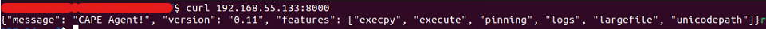
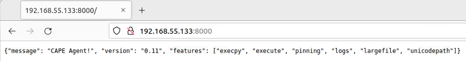

====================
Installing the Agent
====================

The CAPE agent is designed to be cross-platform, therefore you should
be able to use it on Windows as well as on Linux and OS X. To make
CAPE work properly, you'll have to install and start this agent on
every guest.

In the *agent/* directory you will find an *agent.py* file, just copy
it to the Guest operating system (in whatever way you want, perhaps in
a temporary shared folder, downloading it from a Host webserver, or
mounting a CDROM containing the *agent.py* file) and run it. This will
launch the HTTP server which will listen for connections.

.. important::
   It is a **MUST** to launch ``agent.py/w`` with **elevated privileges**. One of the (arguably) easiest way of doing so is creating a Scheduled Task, as explained further below in this page.

On Windows, if you simply launch the script, a Python window will be
spawned, with a title similar to ``C:\Windows\py.exe``. If you want to hide this window you can rename the file from
*agent.py* to **agent.pyw** which will prevent the window from
spawning upon launching the script. 

.. warning::
   It is **encouraged** to use the agent in its window-less version (``.pyw`` extension) 
   given that opening a ``cmd`` window will definitely interfere with `human.py <https://github.com/kevoreilly/CAPEv2/blob/master/analyzer/windows/modules/auxiliary/human.py>`_, causing 
   several problems like blocking the `agent.py <https://github.com/kevoreilly/CAPEv2/blob/master/agent/agent.py>`_. communication with the host or 
   producing no **behavioral analysis** output, just to mention some.

Don't forget to test the agent before saving the snapshot. You can do it both navigating to ``VM_IP:8000`` with a browser from your Host or be executing: ``curl VM_IP:8000``. You should see an output similar to the following:

Prior To Windows 10
===================

If you want the script to be launched at Windows' boot, place the file
in the admin startup folder. To access this folder, open the app
launcher with **Win+R** and search for "shell:common startup" which
will open the folder you want (usually
``C:\ProgramData\Microsoft\Windows\Start Menu\Programs\StartUp``). Do
not place the agent in the user startup folder (usually
``C:\Users\<Username>\AppData\Roaming\Microsoft\Windows\Start
Menu\Programs\Startup``) as it will launch the agent without admin
privileges and therefore insufficient permissions resulting in the
agent not being able to work as intended.

Windows 10+
===========

.. note:: Using the scheduler as documented below is not **strictly necessary**. It is sufficient to take a snapshot with the agent running.

To start the script at boot, you will need to set the agent to be run
as a scheduler task. Dropping it in
``C:\ProgramData\Microsoft\Windows\Start Menu\Programs\StartUp`` will
result in it being ran with improper privilege.

..
   1. Go to "Control Panel" > "System and Security" > "Administrative
   Tools" to access Task Scheduler.

1. Open Windows menu (Win key) and search for **Task Scheduler**.
2. Select **Create Basic Task** from the action list.

   .. image:: ../../_images/screenshots/creating_task_scheduler_0.png
        :align: center

3. Give the task a name (for example ``pizza.pyw``, the name is irrelevant as long as you don't make any mention to CAPE or anything blatant for anti-VM detection algorithms) and click **Next**.
4. Set the trigger as **When I logon** and click **Next**.
5. In the **Action** window, select **Start a program** and click **Next**.
6. In the **Start a program** window, select the path of the *agent.py*, and click **Finish**.
7. After the task is created, click the **Task Scheduler Library** and
   find the one you just created. Right click on it and select
   **Properties**.

   .. image:: ../../_images/screenshots/creating_task_scheduler_1.png
        :align: center

8. In the general tab tell it to **Run with highest privileges**.

   .. image:: ../../_images/screenshots/creating_task_scheduler_2.png
        :align: center

9. Select **OK**.

After that all is done, it will come up on the next restart/login.
