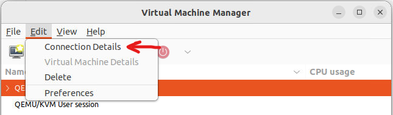

.. _Network Configuration:

=====================
Network Configuration
=====================

Now it's time to set up the network for your virtual machine.

Windows Settings
================

.. note::

    As was discussed in the :ref:`previous chapter <additional_configuration>`, any additional configuration like **disabling** the *Windows Firewall* and the *Automatic Updates* should be done before configuring the network as stated below. Given that VMs may be left without internet connection, it is convenient to download and make changes before this happens. The reason for turning off updates and firewall is that these features can affect the behavior of the malware under normal circumstances and they can pollute the network analysis performed by CAPE, by dropping connections or including irrelevant requests.

Windows 10
==========
To do so in Windows 10, open Control Panel and search for ``Windows Defender Firewall``. Disable it completely:

The next step is disabling automatic updates. To do so, open Control Panel and search for ``Administrative Tools``. Open it, then open ``Services``. Look for the ``Windows Update`` entry and double-click on it. Set Startup type to disabled and click stop.

Windows XP
==========

You can do so from Windows' Control Panel as shown in the picture:

.. image:: ../../_images/screenshots/windows_security.png
    :align: center

Virtual Networking
==================

Now you need to decide whether you want your virtual machine to be able to access the Internet
or your local network.

To make the virtual machine's networking work properly you'll have to configure your machine's
network so that the Host and the Guest can communicate.

Testing the network access by pinging a guest from the host is good practice, to make sure that the
virtual network was set up correctly.

Only use static IP addresses for your guests, since CAPE doesn't support DHCP (at least, as of this writing).

.. warning:: The range ``192.168.122.0/24`` is the default range for KVM's first interface (usually ``virbr01``) and it can be used as an **ANTI VM** check. If you want to read more about ANTI VM checks and how to set up your VM, check this `KVM ANTIVM post`_. 

    .. _`KVM ANTIVM post`: https://www.doomedraven.com/2016/05/kvm.html

The recommended setup is using a Host-Only networking layout with proper
forwarding and filtering configuration done with ``iptables`` on the Host.

We have automated this for you with::

    $ utils/rooter.py

You can read more about ``rooter.py`` in its dedicated chapter: :ref:`rooter`.

In the chapter `Setting a static IP`_ you will find the instructions for configuring a Windows guest OS to use a static IP. In the chapter `Creating an isolated network`_ you will find instructions on how to create an isolated network (usually referred to as ``hostonly``) network and use it in your virtual machine. You can find further instructions on creating VMs with Virtual Machine Manage in `this post`_.

.. _this post: https://www.doomedraven.com/2020/04/how-to-create-virtual-machine-with-virt.html

.. _Creating an isolated network:

Creating an isolated network
============================

The recommended setup is using an isolated network for your VM. In order to do so, you can follow the instructions below if you are using KVM and virt-manager (Virtual Machine Manager).

First, in the Virtual Machine Manager GUI click con **Edit** -> **Connection Details**.

In the opened window click on the **+** sign, at the bottom left corner of the image. We are now defining the details of the new network. Give it a name (hostonly, for example) and make sure you select **Isolated** mode. Then, click on the **IPv$ configuration** drop-down menu and define the range of your network. In the image below only the third octet is changed.

Once the new isolated network is created, if you already created a VM, you can select it from Virtual Machine Manager by clicking ``Show virtual hardware details`` of that specific VM. Then click on the network adapter and choose the recently created network. Then click ``Apply``.

The next thing is checking the new interface was indeed created and the VM is actually using it. From your Host, execute the following command from a command prompt::

> ip a

There should be an interface with the IP address you specified while creating it. in the image above the specific interface is ``virbr1``.

From the guest VM (Windows OS in this example) execute the following command from a command prompt::

> ipconfig

The assigned IP should be in the range of the ``hostonly`` network. 

The guest VM and host **must** have connectivity between them. In order to check it, you can use tools like ``ping`` or ``telnet.``

Please bear in mind that this time the IP is assigned via DHCP, something CAPE does not support. Please set a static IP for your VM. Next chapter has instructions on that.

.. _Setting a static IP:

Setting a static IP
===================

To set up a static IP it is first recommended to inspect the assigned IP, which will be (ideally) in the range of your interface (presumably y virbr0). To see your actual IP settings execute the following command from a command prompt::

> ipconfig /all

.. note:: 
    The IP addresses and ranges used throughout this chapter are just examples. Please make sure you use your own working configurations and addresses.

Open ``Control Panel`` and search for ``Network``. Find and open the ``Network and Sharing Center``. Click ``Change adapter settings.``

Now open the Ethernet adapter and click ``Properties``.

Then click ``Internet Protocol Version 4 (TCP/IPv4)`` and ``Properties``. Set the IP address, Subnet mask, Default gateway and DNS Server according to the results of the ipconfig command.

.. note:: 
    You can set as static IP address the address previously given by DHCP or any other address you like within the range of your interface.

Wait a few seconds and you should have Internet access (in case you are using NAT. Bear in mind an isolated network will not provide Internet connection).

It is important to check connectivity between the Host and the Guest, like in the previous chapter.

This stage is very much up to your requirements and the
characteristics of your virtualization software.

.. warning:: Virtual networking errors!
    Virtual networking is a vital component for CAPE. You must be
    sure that connectivity works between the host and the guests.
    Most of the issues reported by users are related to an incorrect networking setup.
    If you aren't sure about your networking, check your virtualization software
    documentation and test connectivity with ``ping`` and ``telnet``.

Disable Noisy Network Services
==============================

Windows 7 introduced new network services that create a lot of noise and can hinder PCAP processing.
Disable them by following the instructions below.

Teredo
======

Open a command prompt as Administrator, and run::

    > netsh interface teredo set state disabled

Link Local Multicast Name Resolution (LLMNR)
============================================

Open the Group Policy editor by typing ``gpedit.msc`` into the Start Menu search box, and press Enter.
Then navigate to Computer Configuration> Administrative Templates>
Network> DNS Client, and open Turn off Multicast Name Resolution.

Set the policy to enabled.

``gpedit.msc`` missing
======================

.. warning:: If ``gpedit.msc`` is not present in your system (if you are using Windows 10 Home Edition, for example), you can enable it by executing the following commands from an Administrator command prompt::

    > FOR %F IN ("%SystemRoot%\servicing\Packages\Microsoft-Windows-GroupPolicy-ClientTools-Package~*.mum") DO (DISM /Online /NoRestart /Add-Package:"%F")
    > FOR %F IN ("%SystemRoot%\servicing\Packages\Microsoft-Windows-GroupPolicy-ClientExtensions-Package~*.mum") DO (DISM /Online /NoRestart /Add-Package:"%F")

If the commands were successful, you should now be able to execute Run (Win+R) -> ``gpedit.msc``.

Network Connectivity Status Indicator, Error Reporting, etc
===========================================================

Windows has many diagnostic tools such as Network Connectivity Status Indicator and Error Reporting, that reach
out to Microsoft servers over the Internet. Fortunately, these can all be disabled with one Group Policy change.

Open the Group Policy editor by typing ``gpedit.msc`` into the Start Menu search box, and press Enter.
Then navigate to Computer Configuration> Administrative Templates>
System> Internet Communication Management, and open Restrict Internet Communication.

Set the policy to enabled.
